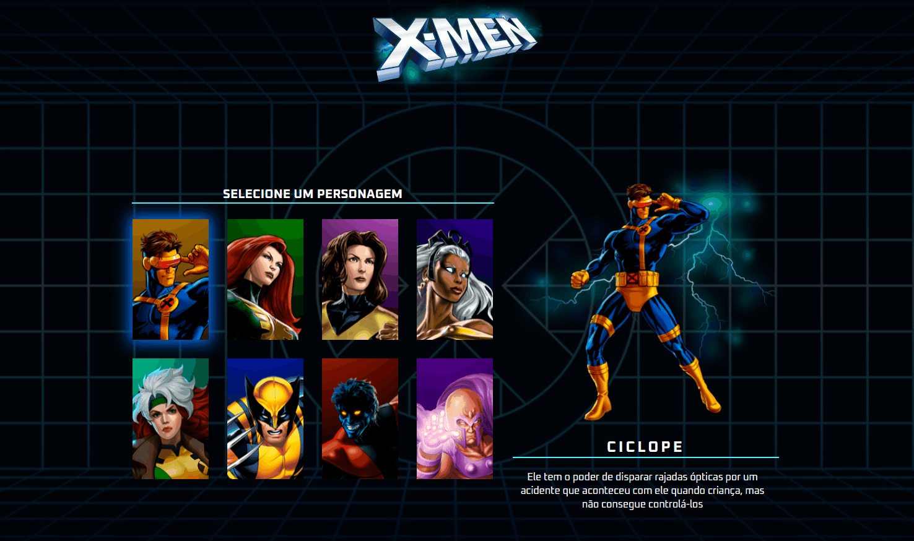

# Projeto X-men
Construí esse projeto junto com <strong>Roberto e Ricardo Dias</strong> do <strong>Dev em Dobro</strong> durante a live do evento <strong>Semana do Zero ao Programador Contratado</strong>.
Se trata da criação de uma página com menu de seleção de personagens com o tema do X-men.

Foi um dos primeiros passos que dei para começar a estudar a programação, eu fui seguindo o passo à passo deles conforme fomos construindo o projeto, foi bem tranquilo, não encontrei muitas dificuldades na parte de <i>html</i> e <i>css</i>. O <i>Javascript</i> era mais complexo e tive um pouco de dificuldade, algumas vezes o código não funcionava e precisei voltar a live para entender se faltou algo ou a maneira como fiz não estava certo. Mas no final deu tudo certo e está funcionando!

Adorei muito conhecer a programação através deles. 👍🚀

## Tecnologias Utilizadas
- HTML
- CSS
- JAVASCRIPT

### Considerações finais

No momento estou muito focado no Dev Quest - o curso de programação do Dev em Dobro - mas em breve quero subir minha versão customizada desse projeto.